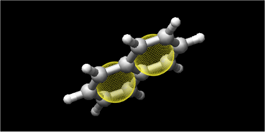
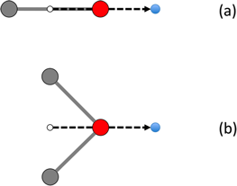
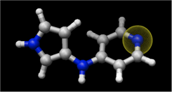
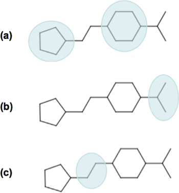
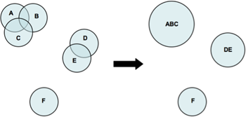
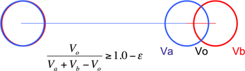
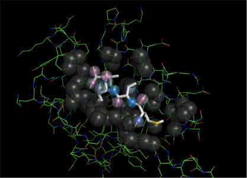

.. _pharao:

########
|Pharao|
########

.. contents:: Table of contents
   :backlinks: none

.. admonition:: Citing Pharao

   Publication of data and results, partly or entirely generated using Pharao,
   should cite the original reference of |pharao|:

   Taminau, J.; Thijs, G.; De Winter, H. (2008) 'Pharao: pharmacophore alignment and 
   optimization', *J. Mol. Graph. Model.* **27**, 161-169.

.. admonition:: Copyright

   |copy| Copyright 2012-2022 by Silicos-it

   Pharao is free software; you can redistribute it and/or modify
   it under the terms of the GNU Lesser General Public License as published 
   by the Free Software Foundation, either version 3 of the License, or
   (at your option) any later version.

   Pharao is distributed in the hope that it will be useful,
   but without any warranty; without even the implied warranty of
   merchantability or fitness for a particular purpose. See the
   `GNU Lesser General Public License <http://www.gnu.org/licenses/>`_
   for more details.

   Pharao is linked against **OpenBabel** 
   version 2. **OpenBabel**  is free software; 
   you can redistribute it and/or modify it under the terms of the GNU 
   General Public License as published by the Free Software Foundation 
   version 2 of the License.

.. admonition:: Version

   Pharao 1.0.4

.. highlight:: console

.. _pharao_introduction:

************
Introduction
************

|pharao| is a tool to align molecules according their pharmacophores. A pharmacophore is an 
abstract concept based on the specific interactions that have been observed in drug-receptor 
interactions: hydrogen bonding, charge transfer, electrostatic and hydrophobic interactions. 
Molecular modeling and/or screening based on pharmacophore similarities have proven to be an 
important and useful method in drug discovery.

The functionality of |pharao| consists mainly of two parts. The first functionality consists of 
the generation of pharmacophores from molecules (see the section on 
:ref:`generation of pharmacophores <pharao_generating_pharmacophore_points>` below). 
Second, pairs of pharmacophores can be 
aligned (see the section on :ref:`aligning pharmacophores <pharao_aligning_pharmacophores>`) 
and the resulting score is calculated from the volume overlap resulting from the alignments.

For the representation of a pharmacophore point, a 3-dimensional Gaussian volume is used in which 
the volume is defined by its center and spread or sigma.

Since alignment methods are dependent on the molecular orientation and position, they tend to 
reflect a combinatorial problem that sometimes results in extensive computation times. Several 
approaches are introduced within |pharao| to handle this problem and this makes |pharao| 
a screening tool that is sufficiently fast. The alignment as implement in |pharao| is called 
a ‘rigid alignment’, meaning that no flexibility of the input structures is assumed and that the 
program always works with one - fixed - conformation. To obtain additional conformations of a 
molecule, external software should be used in a preprocessing step.

In the following section, :ref:`implementation details <pharao_implementation_details>` are 
given in order to provide some insight in the working of |pharao|. In the 
:ref:`usage section <pharao_usage>`, a detailed explanation of the command line 
parameters and functions is given.

.. _pharao_implementation_details:

**********************
Implementation details
**********************

Pharmacophores
==============

Concept
-------

A pharmacophore is described as an ensemble of functional groups, or structural features, with a 
defined geometry. In |pharao| a pharmacophore is represented as a set of pharmacophore points, 
whereby each pharmacophore point is characterized with the following properties:

* the type of the functional group;
* the center of the point;
* the spread (:math:`\alpha`);
* the normal, if applicable.

Each pharmacophore point is modeled as a 3-dimensional spherical Gaussian volume represented by 
its center (coordinate) and spread (:math:`\alpha`). The definition of a Gaussian volume is 
given as follows:

.. raw:: html

   $$ V_a = \int p \exp(-\alpha (m - r)^2) dr = p \sqrt {(\frac{\pi}{\alpha})^3} $$

with :math:`V_a` being the atomic Gaussian volume, *p* the normalization constant to scale the 
total volume to a level that is in relation to atomic volumes, *m* being the center of 
the Gaussian, and *r* being the distance variable that is integrated.

The coordinate *m* of a pharmacophore point defines the position in space. All 
pharmacophore points have a position in space. Each pharmacophore point is also characterized 
by :math:`\alpha` that defines the spread of the Gaussian volume in space. :math:`\alpha` is 
chosen inverse proportional to the square root of the radius.

Each pharmacophore point is characterized by a functional type. These functional types are 
considered to be important in the selective binding of molecules. Each functional group is 
labeled with a four-lettered code and the possibilities as implemented within |pharao| are 
given in the table below.

Some of the pharmacophore points also have a *direction* as defined by its normal. The normal 
is a vector originating from the center of the pharmacophore point. It is optional to include 
this information during alignment and scoring. The rationale for the use of a normal in the 
alignment is that, for instance, a hydrogen bond acceptor works to the outside of the molecule, 
and an aromatic ring is a planar structure that has an orientation in space. This spatial 
orientation is not modeled as such by the Gaussian volume, hence the use of the normal is to take 
this orientation into account.

.. raw:: html

   

   <table class="vendor_table">
   <tr>
      <th style="text-align:left; padding-left:0.5em;">Code</th>
      <th style="text-align:left;">Description</th>
      <th style="text-align:center;">&alpha;</th>
      <th style="text-align:center;">Normal</th>
      <th style="text-align:center;">Hybrid</th>
   </tr>
   <tr>
      <td style="text-align:left; padding-left:0.5em;">AROM</td>
      <td style="text-align:left;">Aromatic ring</td>
      <td style="text-align:center;">0.7</td>
      <td style="text-align:center;">Yes</td>
      <td style="text-align:center;">No</td>
   </tr>
   <tr>
      <td style="text-align:left; padding-left:0.5em;">HDON</td>
      <td style="text-align:left;">Hydrogen bond donor</td>
      <td style="text-align:center;">1.0</td>
      <td style="text-align:center;">Yes</td>
      <td style="text-align:center;">No</td>
   </tr>
   <tr>
      <td style="text-align:left; padding-left:0.5em;">HACC</td>
      <td style="text-align:left;">Hydrogen bond acceptor</td>
      <td style="text-align:center;">1.0</td>
      <td style="text-align:center;">Yes</td>
      <td style="text-align:center;">No</td>
   </tr>
   <tr>
      <td style="text-align:left; padding-left:0.5em;">LIPO</td>
      <td style="text-align:left;">Lipophilic region</td>
      <td style="text-align:center;">0.7</td>
      <td style="text-align:center;">No</td>
      <td style="text-align:center;">No</td>
   </tr>
   <tr>
      <td style="text-align:left; padding-left:0.5em;">POSC</td>
      <td style="text-align:left;">Positive charge center</td>
      <td style="text-align:center;">1.0</td>
      <td style="text-align:center;">No</td>
      <td style="text-align:center;">No</td>
   </tr>
   <tr>
      <td style="text-align:left; padding-left:0.5em;">NEGC</td>
      <td style="text-align:left;">Negative charge center</td>
      <td style="text-align:center;">1.0</td>
      <td style="text-align:center;">No</td>
      <td style="text-align:center;">No</td>
   </tr>
   <tr>
      <td style="text-align:left; padding-left:0.5em;">HYBH</td>
      <td style="text-align:left;">Hydrogen bond donor and acceptor</td>
      <td style="text-align:center;">1.0</td>
      <td style="text-align:center;">Yes</td>
      <td style="text-align:center;">Yes</td>
   </tr>
   <tr>
      <td style="text-align:left; padding-left:0.5em;">HYBL</td>
      <td style="text-align:left;">Aromatic and lipophilic</td>
      <td style="text-align:center;">0.7</td>
      <td style="text-align:center;">No</td>
      <td style="text-align:center;">Yes</td>
   </tr>
   <tr>
      <td style="text-align:left; padding-left:0.5em;">EXCL</td>
      <td style="text-align:left;">Exclusion sphere</td>
      <td style="text-align:center;">1.7</td>
      <td style="text-align:center;">No</td>
      <td style="text-align:center;">No</td>
   </tr>
   </table>
   

.. _pharao_format:

Format
------

Once generated, pharmacophores can be written to a file using a special whitespace-delimited format. 
This way, pharmacophores of molecules can be stored and used for screening or mapping without 
generating this information each time again. It is recommended to use the :file:`.phar` 
extension for pharmacophore files.

The following format is used in |pharao| for reading and writing pharmacophores::

	name
	CODE Cx Cy Cz α norm Nx Ny Nz
	...
	CODE Cx Cy Cz α norm Nx Ny Nz
	$$$$

Every pharmacophore starts with a variable name, which is used to identify the pharmacophore. 
In principle, the name of the pharmacophore is set identical to the title of the molecule 
of which the pharmacophore is calculated. Then for each pharmacophore point a new line is used, 
containing the following information:

* ``CODE`` is one of the nine codes listed in the table above;
* ``Cx``, ``Cy`` and ``Cz`` are the coordinates of the pharmacophore point;
* :math:`\alpha` is the spread of the Gaussian;
* ``norm`` is a Boolean parameter (1 or 0) indicating whether this particular point 
  contains normal information;
* ``Nx``, ``Ny`` and ``Nz`` are the coordinates of the normal. For pharmacophore points 
  with no normal information, these three data points are set to 0.

The end of the pharmacophore is indicated with four dollar signs. This way, a file can contain 
multiple pharmacophores. Lines starting with a ``#`` symbol are considered comment lines 
and are skipped during parsing of a pharmacophore file.

This human-readable format enables the manual modification of a pharmacophore set. To remove a 
pharmacophore point from a pharmacophore,  it is sufficient to remove the corresponding line 
in the file.

.. _pharao_generating_pharmacophore_points:

Generating pharmacophore points
===============================

.. _pharao_aromaticrings:

Aromatic rings
--------------

The generation of aromatic ring pharmacophore points, or ``AROM`` points, includes ring detection 
and aromaticity detection.

Ring systems containing multiple aromatic rings will be converted into multiple ``AROM`` points.
:ref:`Figure 1 <pharao_figure01>` illustrates this for the molecule naphthalene, consisting of 
a ring system with two benzene rings:

.. _pharao_figure01:

   Figure 1. Visualization of the two generated ``AROM`` points for naphthalene. Both points 
   are shown as yellow spheres. The normals are not shown.

The position of the ``AROM`` point is the center of the ring it represents. ``AROM`` points also 
contain a normal as extra information. This normal indicates the orientation of the aromatic ring 
and is placed perpendicular on the plane formed by the ring. Because its sole purpose is to indicate 
the orientation of the plane, the normal is always a unit vector with length 1 Å.

If the angle between two normal vectors is zero, then two corresponding ring planes are parallel 
to each other. The value of this angle can act as a penalty when comparing two ``AROM`` points to 
each other.

.. _pharao_hbd:

Hydrogen bond donors
--------------------

The generation of hydrogen bond donor pharmacophore points, or ``HDON`` points, is based on 
topological information according a simple procedure. For an atom to be labeled as a hydrogen 
bond donor, the atom should fulfill the following conditions:

* Only nitrogen or oxygen atoms;
* Formal charge is not negative;
* At least one attached hydrogen atom.

.. note::

   There is no need to have explicit hydrogen atoms being added to the molecule before extracting
   the pharmacophore points, as the program is using implicit hydrogen bond counts.

The center of the ``HDON`` point is the position of the heavy atom that is labeled as a valid 
hydrogen bond donor. Hydrogen bond donor pharmacophore points are also characterized by normal 
information. The direction of this normal is calculated from the average position of all the 
non-hydrogen atoms that are bound to the hydrogen bond donor atom, shifted to a length of 1 Å 
and projected along this vector to the other side of the hydrogen bond donor atom 
(:ref:`Figure 2 <pharao_figure02>`). The position of the hydrogen atom is not taken into 
account for the calculation of the normal.

.. _pharao_figure02:

   Figure 2. Illustration of the procedure to position the normal on a hydrogen bond donor 
   pharmacophore point as shown for a hydrogen bond donor atom connected to a single heavy atom
   (a) or to two heavy atoms (b). The hydrogen bond donor atom is colored red, the associated 
   normal point light blue, and the attached atoms gray. A similar procedure is used to calculate
   the normals of the hydrogen bond acceptor pharmacophore points.

.. _pharao_hba:

Hydrogen bond acceptors
-----------------------
The generation of hydrogen bond acceptor points, or ``HACC`` points, is less straightforward than 
the generation of ``HDON`` points. A hydrogen bond acceptor needs to fulfill four conditions:

* Only nitrogen or oxygen atoms;
* Formal charge not positive;
* At least one localized lone pair;
* Atom is *accessible*.

These conditions, which will be described in more detail below, are based on the work of
Greene and coworkers [#green]_.

In order to determine condition three - the presence of at least one localized lone pair - only nitrogen 
atoms have to be validated for the presence of localized lone pair electrons. Some 
simple heuristic rules have been implemented to validate this condition.
A nitrogen has no localized lone pair electrons if the nitrogen obeys one of the following patterns:

* N is part of an aromatic ring and has three bonds attached to it (*e.g.* pyrrole);
* ``N-S=O`` (*e.g.* sulfonamide);
* ``N-C=X`` with ``X`` equal to N, O or S (*e.g.* peptide bond);
* N is adjacent to aromatic ring and has three bonds attached to it (*e.g.* aniline).

All other nitrogen atoms are flagged to have at least one localized lone pair.

The fourth condition in the definition of a hydrogen bond acceptor - the *accessibility* of the atom - 
is somewhat more difficult to calculate. Accessibility means that there is enough space for 
a putative hydrogen atom to form a hydrogen bond without forming a steric clash with any 
of the other atoms of the molecule.

This accessibility is calculated by placing a sphere around the putative hydrogen bond acceptor 
atom with a radius of 1.8 Å, thereby mimicking the possible locations where a hydrogen atom 
can be localized in theory. Subsequently a number of points are sampled on this sphere and 
for every point on this sphere it is verified whether a collision with any of the neighboring atoms 
might occur. If at least 2% of the points are labeled as ‘non-colliding’, the putative hydrogen bond 
acceptor atom is labeled as being *accessible*.

By imposing the third and fourth condition as additional criteria for the determination of a hydrogen 
bond acceptor pharmacophore point, the number of hydrogen bond acceptors are significantly 
reduced (:ref:`Figure 3 <pharao_figure03>`).

.. _pharao_figure03:

   Figure 3. Illustration of hydrogen bond acceptor pharmacophore points. Only one ``HACC`` point 
   was generated and is shown as a yellow sphere. The molecule contains three nitrogen atoms that 
   could serve as hydrogen bond acceptor pharmacophore centers, but only the right-most nitrogen 
   satisfies all four constraints and therefore gets labeled as a hydrogen bond acceptor. The normal 
   of the point is not shown.

The normal of the hydrogen acceptor pharmacophore point is calculated in an identical manner as for
the calculation of the normals of the hydrogen bond donor pharmacophore points 
(:ref:`Figure 2 <pharao_figure02>`).

.. _pharao_lipophilic:

Lipophilic spots
----------------

To generate lipophilic pharmacophore points, or ``LIPO`` points, a  procedure as described below is used. 

First, each atom is assigned a lipophilic contribution value. This value is the product of a 
topology-dependent term *t* and an accessible surface fraction *s*. The term *t* is obtained from 
a number of heuristic rules that are listed in the table below. The fraction *s*, representing 
the accessibility of an atom, is calculated using a method similar to the method as described for the
calculation of :ref:`hydrogen bond acceptors <pharao_hba>`. For example, a carbon atom with an 
accessibility of 80% and located three bonds away from double bonded oxygen will have a lipophilic 
contribution of 0.48 (*s* = 0.8, *t* = 0.6)::

   Category     f    Description
   --------   ----   ------------------------------------------------------------------
      1       0.00   N, O or H
      2       0.00   S in SH
      3       0.00   ≤ 2 bonds away from charged atom
      4       0.00   ≤ 2 bonds away from OH or NH with no delocalized electrons
      5       0.00   ≤ 1 bond away from SH with no delocalized electrons
      6       0.00   ≤ 2 bonds away from O with double bond
      7       0.00   ≤ 1 bond away from S with valence > 2
      8       0.00   S with double bond
      9       0.60   3 bonds away from O with double bond
     10       0.60   2 bonds away from S with valence > 2
     11       0.60   1 bond away from S with double bond
     12       0.00   ≥ 2 instances of any of the previous three conditions (cat 9-11)
     13       0.25   1 neighboring O or N with no delocalized electrons
     14       0.00   > 1 neighboring O or N with no delocalized electrons
     15       1.00   Not belonging to any of the previous conditions (cat 1-14)

After having assigned the lipophilic contribution to each atom, the second step is to group atoms 
into regions or spots. The procedure to group atoms into spots is illustrated in 
:ref:`Figure 4 <pharao_figure04>` below, and is based on a number of rules:

* Atoms togther in a ring of size 7 or less form a group (:ref:`Figure 4a <pharao_figure04>`).
* Atoms connected to three or more atoms, and those neighbors that are not bonded 
  to any other non-hydrogen atom, form a group (:ref:`Figure 4b <pharao_figure04>`).
* The remaining of the atoms (the chains) also form groups (:ref:`Figure 4c <pharao_figure04>`).

.. _pharao_figure04:

   Figure 4. Schematic representation of procedure to group atoms into spots. This example molecule 
   contains four spots.

During the third and final step, for each of the identified spots the total lipophilic contribution 
is calculated as the summation of the contributions of every atom belonging to that spot. If 
this value exceeds a predefined threshold, a ``LIPO`` pharmacophore point is created with the 
center being set to the center of the spot. The threshold value is set to 9.87, which is half 
of the lipophilic contribution of an exposed methyl carbon terminating a carbon chain [#green]_.

.. _pharao_chargecenters:

Charge centers
--------------

The formal charges on the atoms of the molecule are used for the generation of charge center pharmacophore 
points. Atoms with a positive formal charge will correspond with a positive charge 
center pharmacophore point, or ``POSC`` point, and atoms with a negative formal charge will define 
the position of a negative charge center pharmacophore point or ``NEGC`` point.

The position of the ``POSC`` and ``NEGC`` points coincides with the position of the atom 
carrying the formal charge.

Hybrid lipophilic centers
-------------------------

Hybrid lipophilic pharmacophores ``HYBL`` are generated by merging proximate
``LIPO`` and ``AROM`` points together. In order for these to be merged, the distance between 
the two respective centers should be less than 1.0 Å. The center coordinates of the new point 
are calculated by taking the average of the two original centers. When hybrid lipophilic 
centers are requested, all ``LIPO`` and all ``AROM`` points are renamed to ``HYBL``. 
After merging and renaming, the normal information of the original aromatic centers is disguarded.

To summarize, generation of ``HYBL`` points is done as follows:

* Isolated ``AROM`` points are renamed to ``HYBL`` and their normal information is disguarded;
* Isolated ``LIPO`` points are renamed to ``HYBL``;
* Proximate ``AROM`` and ``LIPO`` points are merged into a ``HYBL`` single point and the 
  normal information of the original ``AROM`` point is removed. The new coordinates are calculated 
  as the average of the original coordinates.

Hybrid hydrogen donors and acceptor centers
-------------------------------------------

Hybrid hydrogen acceptor/donor pharmacophores ``HYBH`` are generated by merging together ``HACC`` 
and ``HDON`` points that are located on the same atom. In order for these to be merged, the 
distance between the two respective centers should be less than 0.00001 Å. The resulting
new type is set to ``HYBH``.

After merging, the normal of the new center is calculated by taking the average location of the 
two original normals.

.. _pharao_merging:

Merging pharmacophore points
============================

Because of the combinatorial nature of the feature mapping (see :ref:`below <pharao_feature_mapping>`), 
extended sets of pharmacophore points can lead to extensive computational times. A possible solution 
to circumvent this problem is to merge neighboring pharmacophore points of the same category, as 
is illustrated in :ref:`Figure 5 <pharao_figure05>`.

.. _pharao_figure05:

   Figure 5. Schematic representation of the merging process. A pharmacophore consisting of six 
   points is reduced to a new pharmacophore consisting of only three points.

Pharmacophore points are considered to be 'neighbours' if their overlap volume exceeds a threshold value 
of 0.075. The spread :math:`\alpha` of the resulting pharmacophore point is set to 70% of the sum 
of all the original :math:`\alpha` values. A merged pharmacophore point does not contain normal information.

.. _pharao_aligning_pharmacophores:

Aligning pharmacophores
=======================

Problem situation
-----------------

Quantification of the similarity between two pharmacophores can be computed from the overlap 
volume of the Gaussian volumes of the respective pharmacophores. The principle is to identify the 
subset of matching functional groups in each pharmacophore that gives the largest overlap. 
The procedure finds its roots in the work of Grant and Pickup [#grant]_, where the volume overlap 
between two molecules is computed from a Gaussian description of the atomic volumes. In |pharao| 
this approach is translated into the overlap of pharmacophore points.

The procedure to compute the volume overlap between two pharmacophores is implemented in a two-step 
approach. During the first step, a list of all feasible combinations of overlapping pharmacophore 
points is generated. In the second step, the corresponding features are then aligned with each 
other using an optimization algorithm. The combination of features that gives the maximal volume 
overlap is retained to give the matching score.

.. _pharao_feature_mapping:

Feature mapping
---------------

To compute the overlap between a pair of pharmacophores, the first step is to define the points 
from the first pharmacophore (**A**) that can be mapped onto the points from the second pharmacophore 
(**B**). A mapping of two pharmacophores consists of a list of points from **A** and **B** 
in which corresponding points have a compatible functional group and the internal 
distance between the correspodning points lies within a given range requirement. This range, 
as defined by the parameter :math:`\epsilon`, controls the overlap feasibility of a given 
combination of pharmacophore points.

The procedure starts by generating a list of all feasible feature pairs. First, two points 
from pharmacophore **A** are selected and the distance between these points is calculated. 
Next, two points with matching features and distance are selected from **B**. Subsequently, 
the first points of both couples are overlaid and the relative volume overlap between the 
second pair of points is computed according:

.. raw:: html

   $$ \frac{V_o}{V_a + V_b + V_o} $$

in which :math:`V_a` and :math:`V_b` represent the volume of pharmacophore point **a**
and **b**, respectively, and :math:`V_o` the calculated absolute overlap volume. If this 
relative volume overlap is larger or equal than 1.0 - :math:`\epsilon`, the 
combination of the two pairs is set to be *feasible*. This is illustrated in :ref:`Figure 6 
<pharao_figure06>`. 

.. _pharao_figure06:

   Figure 6. Illustration of the :math:`\epsilon` parameter. Two subsets of corresponding 
   pharmacophore points are selected (black and blue). The first points are placed on top 
   of each other (left sphere). The relative volume overlap between the other spheres should be 
   larger than :math:`1.0 - \epsilon`. From this it implies that a smaller :math:`\epsilon` 
   implements a more stringent feasibility criterion.

When :math:`\epsilon` is set equal to 1.0, no limit on the minimal required amount of overlap 
between both pairs of pharmacophore points is imposed. Smaller values of :math:`\epsilon` 
lead to a more stringent overlap criterion.

Once the initial list of feasible pairs is constructed, they can be combined into larger 
combinations. This process is combinatorial in nature and the number of possible combinations 
grows rapidly with the number of pharmacophore points in both pharmacophores. The choice for a 
stringent :math:`\epsilon` value should aid in limiting the number of feasible combinations.

Alignment phase
---------------

Given the set of all feasible combinations, the one that gives the largest volume 
overlap is searched for. For every potential combination, the procedure starts by 
translating the **A** pharmacophore subset such that its geometric center overlaps with
the geometric center of the **B** pharmacophore subset. Next, using a combination of 
gradient-ascent and rigid-body rotation, the maximal volume overlap is determined. 
Details of the methodology are described in reference [#taminau]_ and the manual of 
our :ref:`shape-it <1.0.1/shapeit_optimal_alignment>` tool.

The alignment procedure starts with the combinations that are largest in terms of the
number of matching pharmacophore points. Subsequently, smaller combinations are processed 
until the maximum score so far is larger than the theoretical maximum score any smaller 
combination could achieve, based on the underlying rationale that the maximum achievable 
volume overlap is limited by the number of features to align. 

.. _pharao_alignment_scores:

Alignment scores
----------------

Similarity between the pharmacophores **A** and **B** can be calculated using three different 
measures:

.. raw:: html

   $$ \text{TANIMOTO} = \frac{V_O}{V_A + V_B - V_O} $$

   $$ \text{TVERSKY_A} = \frac{V_O}{V_A} $$

   $$ \text{TVERSKY_B} = \frac{V_O}{V_B} $$

with :math:`V_O` being the maximum volume overlap between both pharmacophores;
:math:`V_A` the volume of pharmacophore **A**; and :math:`V_B` the volume of pharmacophore **B**. 
The *TANIMOTO* measure is well known from bit vector comparison and is 
the default measure in |pharao| to score similarity between pharmacophores. 

Since the focus of the |pharao| tool lies mainly in database searching experiments with
a single reference pharmacophore as query, the similarity measures can be rewritten to reflect this:

.. raw:: html

   $$ \text{TANIMOTO} = \frac{V_O}{V_{ref} + V_{db} - V_O} $$

   $$ \text{TVERSKY_REF} = \frac{V_O}{V_{ref}} $$

   $$ \text{TVERSKY_DB} = \frac{V_O}{V_{db}} $$

with :math:`V_{ref}` the volume of the reference pharmacophore, and :math:`V_{db}` the volume of the
database pharmacophore. The *TVERSKY_REF* measure is primarily intended to identify database 
compounds with a pharmacophore that is a superset of the reference pharmacophore, while 
the *TVERSKY_DB* measure has its use in identifying database compounds having a pharmacophore 
that is subset of the reference pharmacophore. 

All three metrics return a score between 0 and 1.

.. _pharao_usage:

******************
Command line usage
******************

General
=======

:option:`-h`, :option:`--help`
	[OPTIONAL] Help on the use of |pharao| is provided.

:option:`-q`, :option:`--quiet`
	[OPTIONAL] If this parameter is provided, no output, progress or warnings are 
	written out by the program.

:option:`--info` <option>
	[OPTIONAL] With this option the user can get detailed information for each 
	<option> listed below.
	
For example, to get some information about the :option:`--dbase` option, use::
	
	> align-it --info dbase

or::

	> align-it --info d

The <option> argument to :option:`--info` is required, otherwise an error is 
written out::
	
	> align-it --info
	**MainError**  unknown command line option
	
	
Input
=====

By default the format of input molecule files is determined from the extension of those files.
|pharao| supports all file types that are supported by **OpenBabel**. A pharmacophore 
file is specified with the ``.phar`` extension.

:option:`-r`, :option:`--reference` <file>
	[OPTIONAL] This command line option defines the reference structure that will be used to 
	screen and/or align the database molecules against. This option is not required, 
	and when not given then the database will only be converted into pharmacophores 
	without screening. By default the format is deduced from the extension of the file 
	but this format can be defined explicitly with the :option:`--refType` option. 
	The :option:`<file>` argument is required; if not provided then an error is written out.
	
:option:`--refType` <type>
	[OPTIONAL] With this option the format of the reference input file can 
	be specified explicitly. The :option:`<type>` argument is required but 
	is case-insensitive.
	If this :option:`--refType` option is not provided then the format of 
	the reference file is deduced from its file extension.
	Allowed :option:`<type>` argument keywords are those as understood by **OpenBabel**. 
	Complementary to those types as defined by **OpenBabel**,
	an additional :option:`phar` keyword, specific to |pharao|, defines 
	that the reference input file
	will be in a specific :ref:`pharmacophore format <pharao_format>` with precomputed 
	pharmacophore points.
	If this specific pharmacophore format is not used, the program will automatically 
	generate a pharmacophore from the reference using the procedure as described in the 
	section on :ref:`generating pharmacophore points 
	<pharao_generating_pharmacophore_points>`. The cpu-time that is needed for this 
	generation step is negligible compared to the cpu-time that is required for alignment.

.. tip::
   To get a list of all file types that are understood by **OpenBabel**, 
   type::

 	> obabel -L formats

:option:`-d`, :option:`--dbase` <file>
	[REQUIRED] Defines the database of molecules that will be used to screen. This option 
	is required. By default the format is deduced from the file extension but it can 
	also be defined explicitly with the :option:`--dbType` option.

:option:`--dbType` <type>
	[OPTIONAL] With this option the format of the database input file
	can be specified explicitly.
	The :option:`<type>` argument is required but 
	is case-insensitive.
	If this :option:`--dbType` option is not provided then the format of 
	the database file is deduced from its file extension.
	Allowed :option:`<type>` argument keywords are those as understood by **OpenBabel**. 
	Complementary to those types as defined by **OpenBabel**,
	an additional :option:`phar` keyword, specific to |pharao|, defines 
	that the database input file
	will be in a specific :ref:`pharmacophore format <pharao_format>` with precomputed 
	pharmacophore points.
	If this specific pharmacophore format is not used, the program will automatically 
	generate a pharmacophore from 
	each molecule in the database using the procedure as described in the section on 
	:ref:`generating pharmacophore points <pharao_generating_pharmacophore_points>`. 
	The cpu-time that is needed for this generation step is negligible compared to 
	the cpu-time that is required for alignment.

Output
======

:option:`-p`, :option:`--pharmacophore` <file>
	[REQUIRED] The aligned pharmacophores of the structures in the input database are written 
	to this file. The spatial position of these pharmacophores will not correspond to the original 
	structures because they are aligned with respect to the reference input molecule and therefore 
	can have a different orientation. Moreover, only the points that are used in the alignment 
	are written out. If there is not a reference structure defined, or no alignment has taken place, 
	then the complete pharmacophore is written out. This file is written in the specific
	:ref:`farmacophore format <pharao_format>`.
	
:option:`-o`, :option:`--out` <file>
	[OPTIONAL] The aligned database structures are written to this file. By default the format 
	is deduced from the file extension but it can also be defined explicitly with the 
	:option:`--outType` option.

:option:`--outType` <type>
	[OPTIONAL] With this option the format of the molecular output file
	can be specified explicitly.
	The :option:`<type>` argument is required but 
	is case-insensitive.
	If this :option:`--outType` option is not provided then the format of 
	the molecular output file is deduced from its file extension.
	Allowed :option:`<type>` argument keywords are those as understood by **OpenBabel**. 

:option:`--cutOff` <double>
	[OPTIONAL] This value should be between 0 and 1 and only structures with a score larger
	than this cutoff will be written to the files defined by the :option:`--out`, 
	:option:`--scores` and :option:`--pharmacophore` options. The :option:`--rankby` option 
	specifies the scoring function to be used for ranking.
	 
:option:`--best` <int>
	[OPTIONAL] With this option only a limited number of best scoring structures, as defined by
	:option:`--rankby`, are reported in the three possible output files. If the :option:`--cutOff`
	option is also specified, all best scoring structures are first passed through that filter. 
	The user can specify the number of best scoring structures that should be reported.
	
:option:`--rankBy` <TANIMOTO|TVERSKY_REF|TVERSKY_DB>
	[OPTIONAL] This option defines the scoring used by the previous two options. More information 
	about the three possible metrics can be found in the section on :ref:`alignment scores
	<pharao_alignment_scores>`. By default, the ``TANIMOTO`` measure is used.

:option:`-s`, :option:`--scores` <file>
	[OPTIONAL] With this option a tab-delimited output text file can be generated, containing
	all results in a text-readable format.
	
The format of this optional scores output file (:option:`-s` or :option:`--scores`) is as follows::

   column    Content
   ------    ---------------------------------------------------------------------
        1    Id of the reference structure
        2    Maximum volume of the reference structure
        3    Id of the database structure
        4    Maximum volume of the database structure
        5    Maximum volume overlap of the two structures
        6    Overlap between pharmacophore and exclusion spheres in the reference
        7    Corrected volume overlap between database pharmacophore and reference
        8    Number of pharmacophore points in the processed pharmacophore
        9    TANIMOTO score
       10    TVERSKY_REF score
       11    TVERSKY_DB score

Options
=======

:option:`-f`, :option:`--funcGroup` <AROM|HDON|HACC|LIPO|CHARGE>
	[OPTIONAL] By default the generated pharmacophores contain all functional groups and 
	thus include all information that might be useful. With this option only a subset of 
	the available functional groups can be used in the alignment. The user can define this 
	subset by using the tags listed below with the ‘,’ symbol as separator. See 
	below for :ref:`examples <pharao_examples>`. 
	``AROM``: :ref:`aromatic rings <pharao_aromaticrings>`, 
	``HDON``: :ref:`hydrogen bond donors <pharao_hbd>`,  
	``HACC``: :ref:`hydrogen bond acceptors <pharao_hba>`, 
	``LIPO``: :ref:`lipophilic spots <pharao_lipophilic>`, 
	``CHARGE``: :ref:`charge centers <pharao_chargecenters>`. 
	If the reference and database structures are provided in the pharmacophore format 
	then this option is discarded.
	
:option:`-e`, :option:`--epsilon` <double>
	[OPTIONAL] This option can be used to change the tolerance for points to be matched in 
	the alignment phase. This is an important parameter to control the 
	:ref:`feature-mapping phase <pharao_feature_mapping>` as described before.
	The lower this value, the more strict the matching between two pharmacophores will have to 
	be before they can be aligned. Higher values imply a higher allowed level of initial mismatching 
	and typically result in larger computing times. The range of this parameter is between 0 and 1. 
	The default value is 0.5.
	
:option:`-m`, :option:`--merge`
	[OPTIONAL] Flag to indicate that pharmacophore points will be :ref:`merged <pharao_merging>` as 
	explained above. Setting this flag also activates the :option:`-n` or :option:`--noNormal` 
	flag because merged pharmacophore points do not contain a normal.
	
:option:`-n`, :option:`--noNormal`
	[OPTIONAL] Flag to indicate that no normal information is included during the alignment. 
	Using this flag makes the pharmacophore models less specific but also less conformation-dependent.
	
:option:`--noHybrid`
	[OPTIONAL] Flag to indicate that hybrid points should not be calculated. The list of hybrid 
	pharmacophore points is given in the table above and is generated by default to reduce the 
	number of pharmacophore points.
	
:option:`--scoreOnly`
	[OPTIONAL] Flag to indicate that the poses will be used as provided in the input file. 
	No translational or rotational optimization will be performed. The best score reported 
	is the one from the feasible mapping with the highest volume overlap.
	
:option:`--withExclusion`
	[OPTIONAL] Flag to indicate if the exclusion spheres should be part of the optimization procedure. 
	By default, the overlap between pharmacophore and exclusion spheres is only taken into account at 
	the end of the alignment procedure. When this flag is set, the exclusion spheres have also an 
	impact on the optimization procedure.

.. _pharao_examples:

Examples
========

In the first example the task is to generate pharmacophores for a number of structures and store 
these for later use::

	> align-it --dbase db.sdf --pharmacophore output.phar

or shorter::

	> align-it -d db.sdf -p output.phar
	
In the next example a virtual screening is performed. After screening a database against a reference 
structure, only the ranking based on the ``TANIMOTO`` score is of interest::

    > align-it --reference      ref.phar
               --refType        PHAR 
               --dbase          db.phar
               --dbType         PHAR
               --pharmacophore  output.phar
               --scores         result.tab
    > sort -k 9 -r result.tab > sortedResult.tab

Calculating pharmacophores as in the first example, but without using hydrogen bond donor and acceptor 
information, is done by typing::

	> align-it -d db.sdf -p output.phar --funcGroup AROM,LIPO,CHARGE
	
Finally an example is presented whereby a small fragment is used as a reference pharmacophore and 
the only purpose is to find structures that include this pharmacophore. Only structures with a common 
overlap covering at least 80% of the reference volume are reported in :file:`output.phar` and 
:file:`result.tab`. Notice that a ranking is made based on column 10 instead of column 9::

   > align-it --reference      ref.sdf 
              --dbase          db.phar       
              --dbType         PHAR 
              --pharmacophore  output.phar
              --scores         result.tab
              --cutOff         0.8
              --rankBy         TVERSKY_REF
   > sort -k 10 -r result.tab > sortedResult.tab

********************
Command line summary
********************

Summary of the command line arguments to |pharao|::

   GENERAL
   -------
   [O] -h, --help            N/A    Provides a short description of usage.
   [O] --info                N/A    Provides a detailed description for each option.
   [O] -q, --quiet           N/A    If this flag is set, minimum output is given to
                                    the user during execution of the program.
   [O] -v, --version         N/A    Provides the version of the program.

   INPUT
   -----
   [O] -r, --reference         -    Defines the reference molecule or pharmacophore
                                    that will be used to screen and/or align a
                                    database.
   [O] --refType               -    Indicates the type of the reference data file.
   [R] -d, --dbase             -    Defines the database that will be screened and/or
                                    aligned.
   [O] --dbType                -    Indicates the type of the database data file.
   
   OUTPUT
   ------
   [R] -p, --pharmacophore     -    File with the computed pharmacophores of the input
                                    database.
   [O] -o, --out               -    The transformed database molecules after aligning
                                    them to the reference pharmacophore.
   [O] --outType               -    Indicates the type of the output molecular data file.
   [O] -s, --scores            -    Tab-delimited text file with for each molecule the
                                    number of corresponding pharmacophore points and
                                    the overlap scores.
   [O] -l, --log               -    Log file of the current run.
   [O] --cutOff              0.0    Minimum score for a structure to be reported.
   [O] --best                  0    Only best scoring molecules are reported.
   [O] --rankBy         TANIMOTO    Define scoring used by --cutOff and --best.
   
   OPTIONS
   -------
   [O] -f, --funcGroup       ALL    Flag to define functional groups used in the
                                    creation of pharmacophores.
   [O] -e, --epsilon         0.5    Option to change the tolerance for points to be
                                    matched.
   [O] -m, --merge           N/A    Flag to merge pharmacophore points.
   [O] --noNormal            N/A    Flag to ignore normal information during alignment.
   [O] --noHybrid            N/A    Flag to disable the use of hybrid pharmacophore 
                                    points.
   [O] --scoreOnly           N/A    Flag to indicate that the volume overlap should be
                                    computed from the given poses and that no 
                                    translational or rotational optimization should be
                                    done.
   [O] --withExclusion       N/A    Flag to add exclusion spheres into the optimization
                                    process instead of processing them afterwards.

.. _pharao_installation:

************
Installation
************

Installation of the |pharao| program relies on the libraries of **OpenBabel** version 2.3. 
Installation of **OpenBabel** is exemplified in the 
:ref:`Configuring OS X for chemoinformatics <configuring_osx_for_chemoinformatics>` section 
of this website.

The installation of |pharao| assumes that the :envvar:`BABEL_DATADIR`, 
:envvar:`BABEL_LIBDIR`, and :envvar:`BABEL_INCLUDEDIR` point to the directories 
where **OpenBabel** has been installed::

	> echo $BABEL_INCLUDEDIR
	/usr/local/openbabel/include/openbabel-2.0/
	> echo $BABEL_LIBDIR
	/usr/local/lib/openbabel/2.3.1/
	> echo $BABEL_DATADIR
	/usr/local/openbabel/share/openbabel/2.3.1/

Start by downloading |pharao| from our :ref:`software <software>` section and
un-tar this file into your :file:`/usr/local/src` directory::

	> cd /usr/local/src
	> sudo tar -xvf ~/Downloads/align-it-1.0.4.tar.gz

Change into this directory and start the building process::

	> cd align-it-1.0.4
	> sudo mkdir build
	> cd build
	> sudo cmake ..
	> sudo make
	> sudo make install
	
This latter command will install the |pharao| executable in the :file:`/usr/local/bin/` directory.
Finally, check the installation by entering::

	> which align-it
	/usr/local/bin/align-it
	> align-it -h
    ...

*****************
PyMol integration
*****************

**PyMol** is an open source visualization program well suited to 
produce high quality images of small molecules and biological macromolecules such as proteins. 
One of the main advantages of **PyMol** is its powerful scripting language. 

The |pharao| package can be downloaded from our :ref:`software <software>` section. The
package contains a :file:`align-it.py` **Python** script to integrate the |pharao| functionality 
into **PyMol**. The :file:`align-it.py` script is located in the :file:`pymol/` folder of the 
downloadable distribution. The :file:`align-it.py` script will be installed as a plug-in
into **PyMol**.

.. _pharao_figure07:

   Figure 7. Example of pharmacophore visualization in **PyMol**.

Installation on Mac OS X
========================

In order to install the |pharao| plug-in under Mac **OS X**, proceed according the following steps:

* Change the application name :file:`MacPyMOL.app` into :file:`Py-MOLX11Hybrid.app`. You will 
  probably find the :file:`MacPyMOL.app` file in the :file:`/Applications` directory::

  > cd /Applications
  > cp MacPyMOL.app PyMOLX11Hybrid.app

* Copy :file:`align-it.py` into the :file:`Py-MOLX11Hybrid.app` directory (supposing that the
  :file:`align-it.py` is located in the :file:`~/Downloads` directory)::

  > cp ~/Downloads/align-it.py /Applications/PyMOLX11Hybrid.app/pymol/modules/pmg_tk/startup/

* Start ``PyMOLX11Hybrid`` by double-clicking and activate the plug-in by choosing *AlignIt* 
  from the *Plugin* menu. If successful, a new window containing a simple menu will show up.

Usage
=====

The |pharao| **PyMol** plug-in menu offers four options:

* Create pharmacophores: to create a new pharmacophore the user first has to select a 
  compound with the default selection name (sele). The |pharao| tool should have been installed
  at :file:`/usr/local/bin/align-it` (this should be the case if the installation procedure has 
  been followed as described :ref:`below <pharao_installation>`). After executing |pharao|, 
  all temporary files are removed and the pharmacophore is displayed and saved internally.

* Read pharmacophores: instead of calculating a pharmacophore it is also possible to read 
  a pharmacophore file. Only files with :file:`.phar` extension are recognized. The pharmacophore 
  is also saved internally.

* Write pharmacophores: saves the last calculated or read pharmacophore in the :ref:`file format 
  <pharao_format>` as described above.

* Create exclusion spheres: exclusion spheres are pharmacophore points and are generated based 
  on the environment of the selected compound. All atoms of the target within a distance smaller 
  than 4.5 Å of the ligand will correspond to a sphere with sigma 0.7 Å. The generated 
  pharmacophore points are saved internally. If there was already a pharmacophore saved, 
  they will be appended to it.

**********
References
**********

.. [#green] Green, J.; Kahn, S.; Savoi, H.; Sprague, P.; Teig, S. (1994) 'Chemical function queries 
   for 3D database search', *J. Chem. Inf. Comput. Sci.*, **34**, 1297-1308 [`acs/ci00022a012
   <http://pubs.acs.org/doi/abs/10.1021/ci00022a012>`_]

.. [#grant] Grant, J.A.; Gallardo, M.A.; Pickup, B.T. (1996) 'A fast method of molecular shape 
   comparison: a simple application of a Gaussian description of molecular shape',
   *J. Comp. Chem.* **17**, 1653-1666 [`wiley/19961115 <http://onlinelibrary.wiley.com/doi/10.1002/(SICI)1096-987X(19961115)17:14%3C1653::AID-JCC7%3E3.0.CO;2-K/abstract>`_]

.. [#taminau] Taminau, J.; Thijs, G.; De Winter, H. (2008) 'Pharao: pharmacophore alignment and 
   optimization', *J. Mol. Graph. Model.* **27**, 161-169 [`pubmed/18485770 
   <http://www.ncbi.nlm.nih.gov/pubmed/18485770>`_]

 

****************
Revision history
****************

Version 1.0.4
==============

[released on July 12, 2013]

The columns in pharmacophore files are now allowed to be separated by whitespace (blanks and tabs) instead
of only tabs.

Version 1.0.3
==============

[released on August 30, 2012]

Updated the :option:`--refType <type>` and :option:`--dbType <type>` parameters so that the actual 
input file formats can be specified with these arguments as well (in prior versions, only the 
:option:`'MOL'` or :option:`'PHAR'` types where allowed, and in case that the
:option:`'MOL'` type was specified, the actual file format had to be deduced from the file extension).

Added the :option:`--outType <type>` option to define the desired format of the output file with
aligned molecules. When the :option:`--outType` is not given, the format is deduced from the output
file extension.

Version 1.0.2
==============

[released on May 22, 2012]

Updated the ``FindOpenBabel2.cmake`` file (thanks to Abhik Seal) and corrected a bug in the 
PyMol interface so that a pharmacophore gets constructed only from the selected atoms (thanks
to Emilie PiHan)

Version 1.0.1
==============

Corrected some ``#infdef`` preprocessor rules that led to warnings on some compilers and included
the definition of a ``NULL`` value (thanks to Anne Walter) [released on March 26, 2012]

Version 1.0.0
==============

This is the first official release of |pharao|. The program is a successor of the program *Pharao*
from Silicos and is branched out of version 3.0.3 of this program.

Additions to the original *Pharao* version include:

* Porting the documentation to ``html`` and adding some improvements to the documents.
